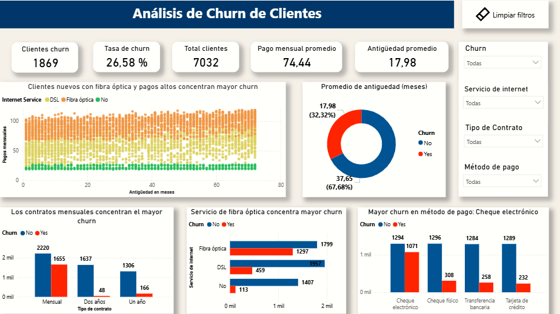

# Análisis de churn de clientes de una empresa de telecomunicaciones

Este proyecto analiza la deserción de clientes (churn) de una empresa de telecomunicaciones para identificar patrones y factores clave.

## 📊 Dashboard Interactivo
Para explorar el dashboard interactivo en tiempo real haga clic en la imagen de abajo :

---

## 🛠️ Herramientas Utilizadas
* **SQL (MySQL):** Extracción y consulta de datos.
* **Python (Pandas/Matplotlib):** Limpieza de datos y análisis exploratorio (EDA).
* **Power BI:** Visualización de datos y creación del dashboard interactivo.

## 📈 Hallazgos Principales
* **Fibra Óptica:** Los clientes con este servicio presentan la tasa de churn más alta.
* **Contratos Mensuales:** Los clientes con contratos de mes a mes son más propensos a abandonar la empresa.
* **Método de Pago:** El cheque electrónico es el método con mayor incidencia de deserción.
